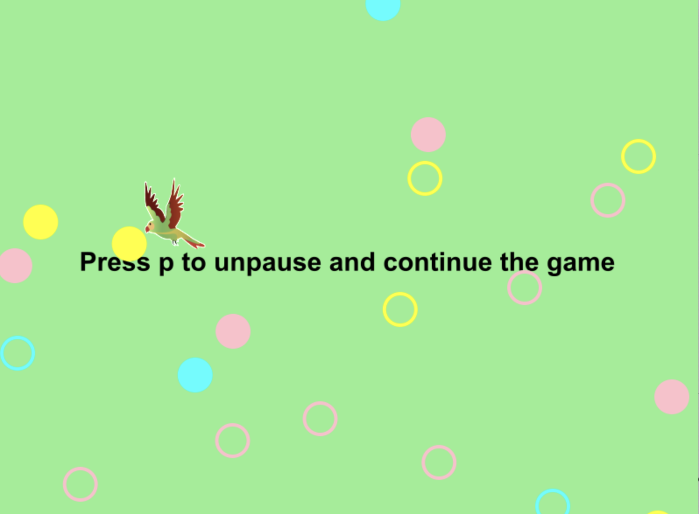

# **A Game of Flying Birds**

By Qidu(Quentin) Fu

## Outline
- [1 Ideation and description](#1)
  - [1.1 Ideation](#1.1)
  - [1.2 Brief description](#1.2)
- [2 How to run the project](#2)
- [3 A list of shortcut commands](#3)
 

## **1 Ideation and description:**

### **1.1 Ideation:**
This project titled “A Game of Flying Birds” (in [112TermProject.py](112TermProject.py)) is based on the scaffolded project developed by Michael Taylor 
(Spring 2023 15112 instructor, Mike hereafter), which originates from the bee game, 
[the Google Doodle for Earth Day 2020.](https://www.google.com/doodles/earth-day-2020)

### **1.2 Brief description:**
This term project uses the main ideas from the scaffolded project developed by Mike. Thus, it contains three main components: 
- The main flying bird (player flying bird, as Mike calls it player bee) 
moves along the cursor and collects the pollen and pollinate flowers. (It is more fun to see birds collecting/pollinating flowers.)
- Two flying birds (helper flying bird, as Mike calls it) 
automatically help the main flying bird to collect the pollen
and pollinate flowers.
- Flowers are generated every five steps 
within a max of 20 flowers on screen.The off-screened flowers are removed.
Each pollinator (flower) can be gathered twice, but each pollinated flower can only be pollinated once.

A [screenshot](images/gameDemo.png) of the game:

For a demo of the game, please see the [YouTube video](https://youtu.be/Xma-Pj436HI)

## **2 How to run the project:**

To run this project, you will need to put the [birdPic.png](images/birdPic.png), [112TermProject.py](112TermProject.py), 
and [cmu_graphics](https://academy.cs.cmu.edu/desktop) into the same folder/directory. 
Then, open the 112TermProject.py file in your text editor, such as VScode. 

## **3 A list of shortcut commands:**
- Move your cursor on the player bird's feet to gather/pollinate flowers
- Press p to pause the game
- Press p to unpause the game
- Press h to get helper birds
- Press r to restart the game

After your press these keys, and within 1050 steps (maybe around 1.5 minutes), you should see all the major features. 
